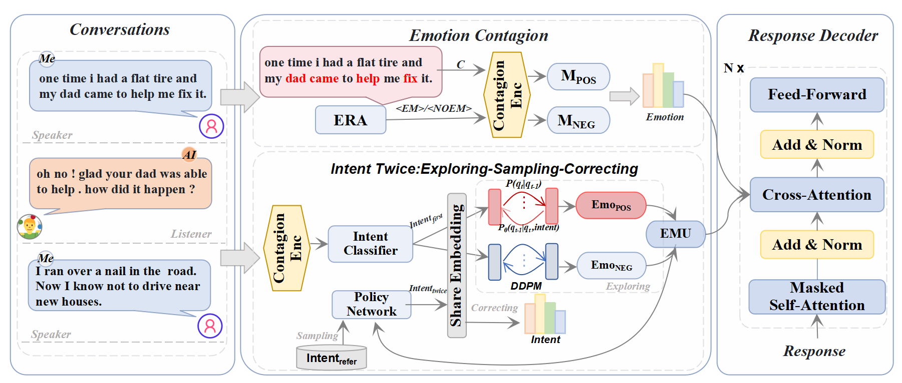

## ReflectDiffu: Reflect between Emotion-intent Contagion and Mimicry for Empathetic Response Generation via a RL-Diffusion Framework
### Model Architecture

### Citation
If you find our work useful for your research, please kindly cite our paper as follows:
```bibtex
@article{yuan2024reflectdiffu,
  title={ReflectDiffu: Reflect between Emotion-intent Contagion and Mimicry for Empathetic Response Generation via a RL-Diffusion Framework},
  author={Yuan, Jiahao and Di, Zixiang and Cui, Zhiqing and Yang, Guisong and Naseem, Usman},
  journal={arXiv preprint arXiv:2409.10289},
  year={2024}
}
```
